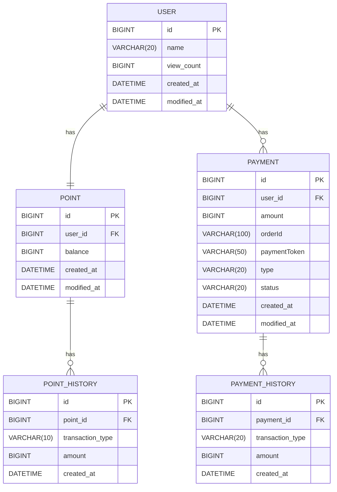

## 목차
- [README.md](../README.md)
- [클래스 다이어그램](classDiagram.md)
- [시퀀스 다이어그램](sequenceDiagram.md)
- [ERD](erd.md)

---
## ERD

```mermaid
erDiagram
    USER ||--|| POINT : has
    USER ||--o{ PAYMENT : has
		POINT ||--o{ POINT_HISTORY : has
    PAYMENT ||--o{ PAYMENT_HISTORY : has

    USER {
        BIGINT id PK
        VARCHAR(20) name
        BIGINT view_count
        DATETIME created_at
        DATETIME modified_at
    }

    POINT {
        BIGINT id PK
        BIGINT user_id FK
        BIGINT balance
        DATETIME created_at
        DATETIME modified_at
    }

    POINT_HISTORY {
        BIGINT id PK
        BIGINT point_id FK
        VARCHAR(10) transaction_type
        BIGINT amount
        DATETIME created_at
    }

    PAYMENT {
        BIGINT id PK
        BIGINT user_id FK
        BIGINT amount
        VARCHAR(100) orderId
        VARCHAR(50) paymentToken
        VARCHAR(20) type
        VARCHAR(20) status
        DATETIME created_at
        DATETIME modified_at
    }

    PAYMENT_HISTORY {
        BIGINT id PK
        BIGINT payment_id FK
        VARCHAR(20) transaction_type
        BIGINT amount
        DATETIME created_at
    }

```