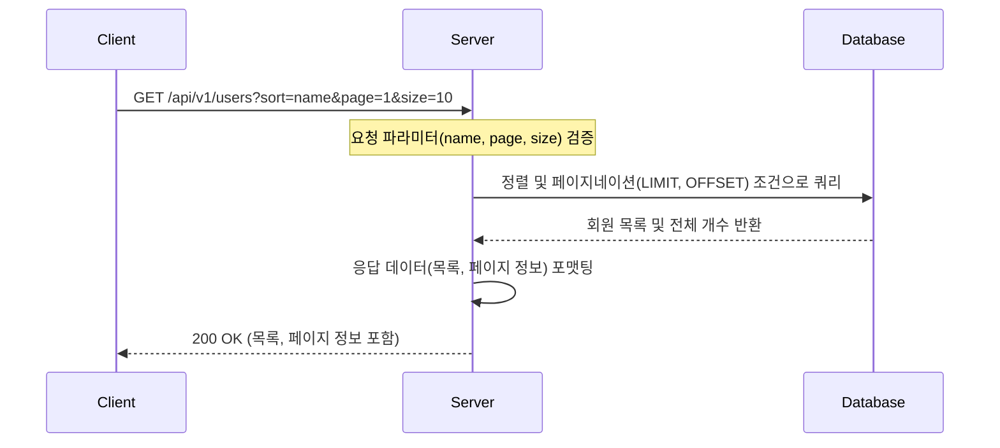
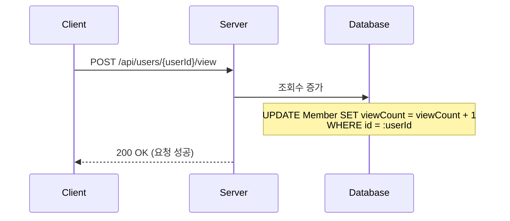
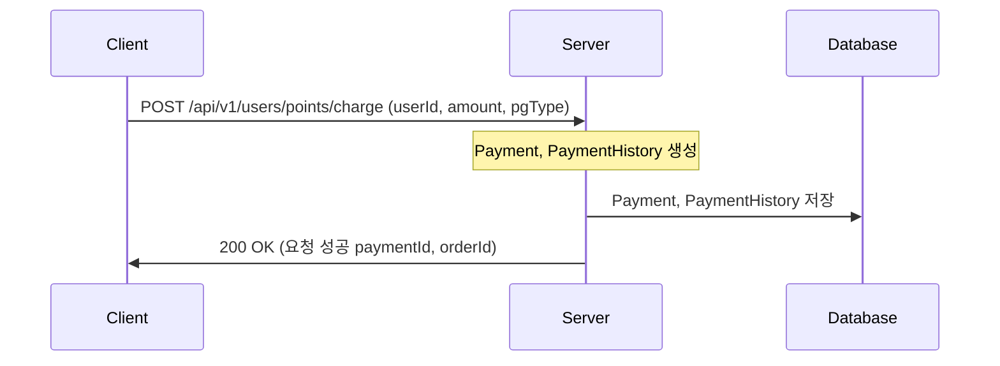
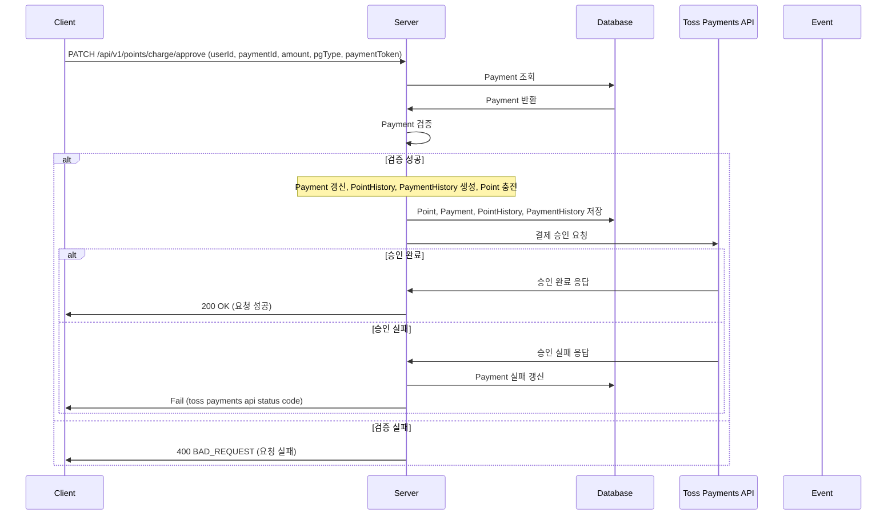
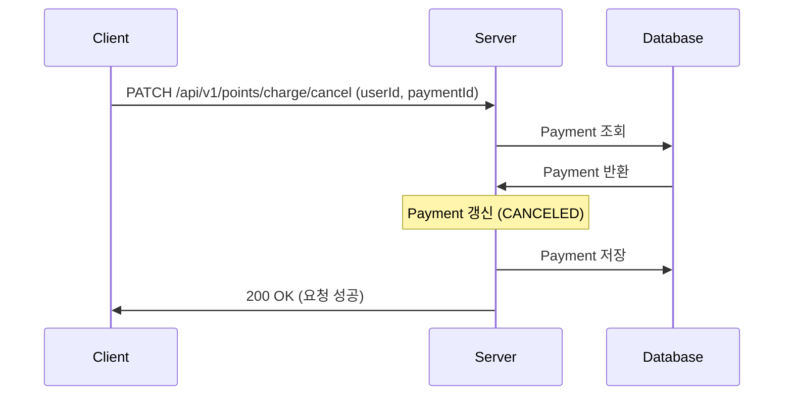

## 목차
- [README.md](../README.md)
- [클래스 다이어그램](classDiagram.md)
- [시퀀스 다이어그램](sequenceDiagram.md)
- [ERD](erd.md)

---
## 시퀀스 다이어그램

* [1. 유저 프로필 목록 API](#프로필-목록-조회)
* [2. 유저 조회수 증가 API](#유저-조회수-증가)
* [3. 포인트 충전 요청 API](#포인트-충전-요청)
* [4. 포인트 충전 결제 완료 API](#포인트-충전-결제-완료)
* [5. 포인트 충전 결제 취소 API](#포인트-충전-결제-취소)

---

## 프로필 목록 조회

## 유저 조회수 증가

## 포인트 충전 요청

## 포인트 충전 결제 완료

## 포인트 충전 결제 취소
